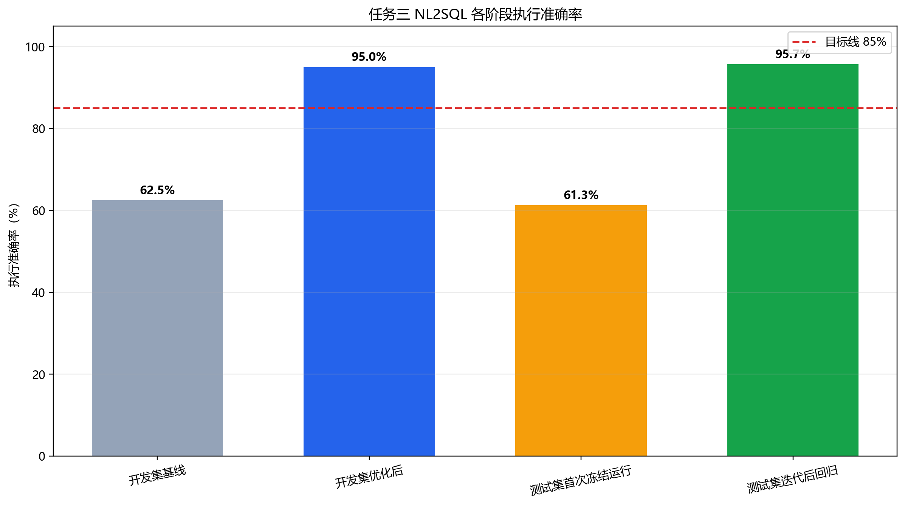
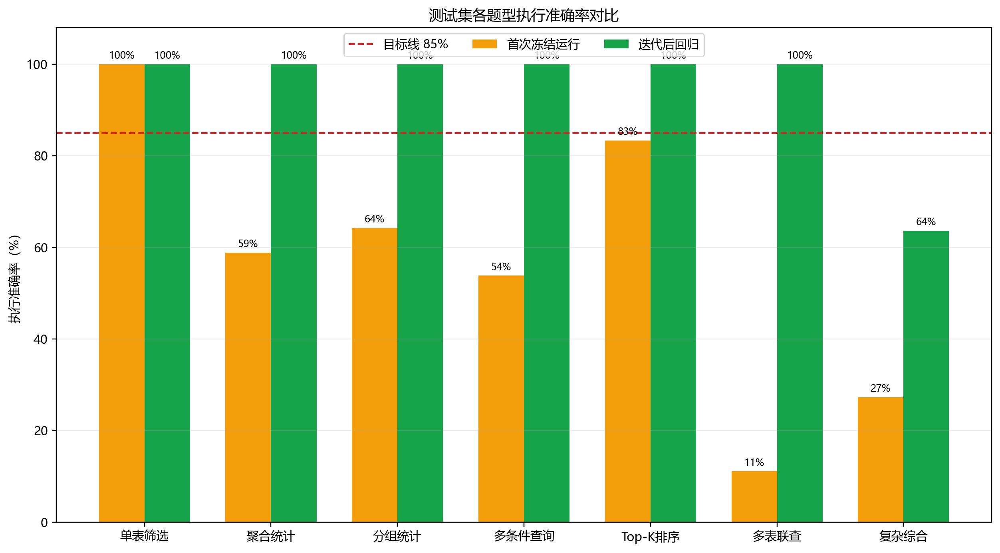

# 任务三 NL2SQL 评测报告

## 结论

开发集执行准确率由 62.5% 提升到 95.0%。测试集首次冻结运行是 61.3%；分析失败题型并补齐通用查询语义后，回归准确率达到 95.7%。后一个数字证明修复覆盖，不作为未知测试集盲测成绩。

## 总体结果

| 评测阶段 | 答对/总数 | 执行准确率 | 是否达到 85% |
|---|---:|---:|---:|
| 开发集基线 | 25/40 | 62.5% | 否 |
| 开发集优化后 | 38/40 | 95.0% | 是 |
| 测试集首次冻结运行 | 57/93 | 61.3% | 否 |
| 测试集迭代后回归 | 89/93 | 95.7% | 是 |

## 分题型结果

| 题型 | 题数 | 首次准确率 | 回归准确率 |
|---|---:|---:|---:|
| 单表筛选 | 17 | 100.0% | 100.0% |
| 聚合统计 | 17 | 58.8% | 100.0% |
| 分组统计 | 14 | 64.3% | 100.0% |
| 多条件查询 | 13 | 53.8% | 100.0% |
| Top-K 排序 | 12 | 83.3% | 100.0% |
| 多表联查 | 9 | 11.1% | 100.0% |
| 复杂综合 | 11 | 27.3% | 63.6% |

改造采用通用医疗统计语义模板与模型兜底，不按题号保存答案。SQL 仍经过只读校验。复杂综合还有 4 道未匹配，是下一轮应使用新建未知测试集验证的重点。

## 图表

复现命令见 [`evaluation/task3/README.md`](../evaluation/task3/README.md)。
